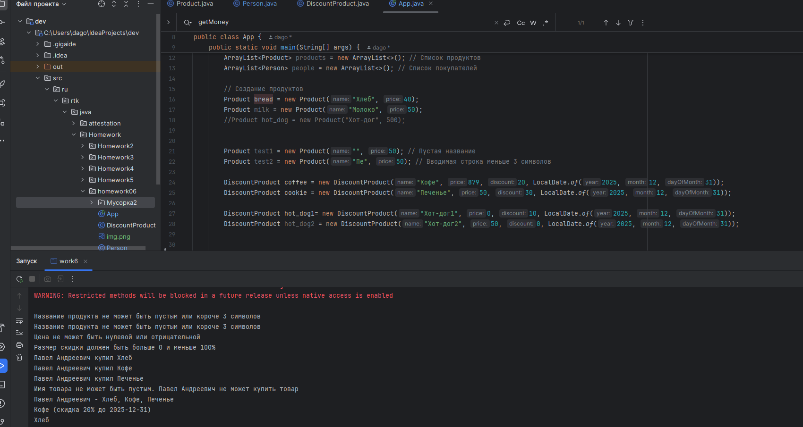

# Промежуточная аттестация Модуль 1: Введение в Java

## Описание задачи

Домашнее задание по теме
«Понятия ООП: наследование, полиморфизм»
Формулировка задания:
Расширить программу из задания с промежуточной аттестации.
Добавить механизм наследования.
В программе должно быть два класса – один для обычных продуктов –
Product, а другой для специальных – DiscountProduct.
• Product - представляет обычный продукт из прошлого домашнего
задания. Характеристики Продукта: название и стоимость. Название продукта
не может быть пустой строкой, оно должно быть. Стоимость продукта не может
быть отрицательным числом.
• Скидочный продукт — специальный продукт, цена которого снижена на
размер скидки. У скидки есть также срок действия. После завершения срока
действия скидка меняется.
Ограничения в классах для продуктов:
- Название продукта не должно содержать только цифры;
- Если название продукта короче, чем 3 символа, то такое название
  недействительно;
- Если стоимость продукта или скидочного продукта 0 или
  отрицательная, то такая цена неправильная. Должна быть ошибка валидации.
  Программа реализуется в отдельной ветке git homeworks/homework07.
  При сохранении состояния программы (коммиты) пишется сообщение с
  описанием хода работы по задаче.
  В корне папки с программой должен быть файл .gitignore.
  Программа локально коммитится и публикуется в репозиторий GitHub на
  проверку.

## Тестовые данные
Внутри кода

## Ответы(скрины):

