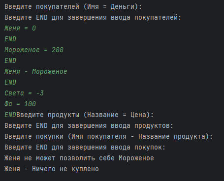

# Промежуточная аттестация Модуль 1: Введение в Java

## Описание задачи

Реализовать приложение, принимающее список пользователей, продуктов и обрабатывающее покупку пользователя. Приложение должно:

- Создавать классы `Person` и `Product`.
- Обрабатывать ввод с клавиатуры.
- Проверять валидность данных (имя, деньги, цена).
- Реализовать логику покупки.
- Переопределять методы `toString()`, `equals()` и `hashCode()`.
- Корректно выводить результаты.

## Тестовые данные

Пример входных данных:

Павел Андреевич = 10000; Анна Петровна = 2000; Борис = 10
END
Хлеб = 40; Молоко = 60; Торт = 1000; Кофе растворимый = 879; Масло = 150
END
Павел Андреевич - Хлеб
Павел Андреевич - Масло
Анна Петровна - Кофе растворимый
Анна Петровна - Молоко
Анна Петровна - Молоко
Анна Петровна - Молоко
Анна Петровна - Торт
Борис - Торт
Павел Андреевич - Торт
END

Женя = 0
END
Мороженое = 200
END
Женя - Мороженое
END
Света = -3
Фа = 100
END

Ответы:

