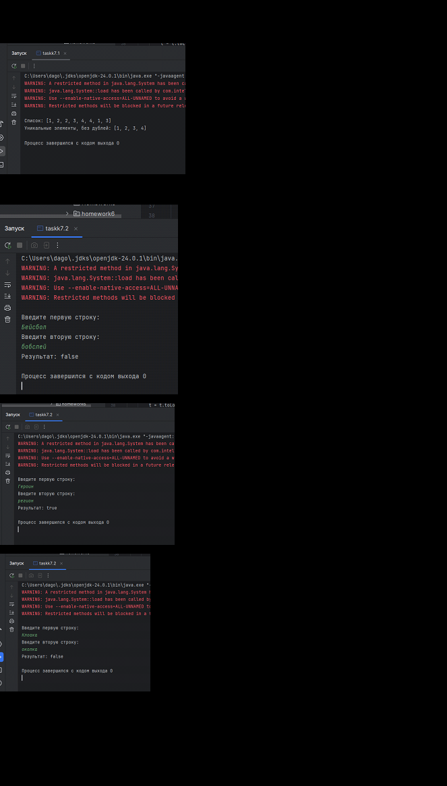

Домашнее задание: Generics и Коллекции
📋 Описание задания
Задание 1
Реализовать метод, который на вход принимает ArrayList<T>, а возвращает набор уникальных элементов этого массива. Решить, используя коллекции.

Пример:

text
Вход: [1, 2, 3, 2, 1, 4]
Выход: [1, 2, 3, 4]
Задание 2
С консоли на вход подается две строки s и t. Необходимо вывести true, если одна строка является валидной анаграммой другой строки, и false – если это не так.
Анаграмма – это слово или фраза, образованная путем перестановки букв другого слова или фразы, обычно с использованием всех исходных букв ровно один раз.

Примеры для проверки:
Бейсбол – бобслей
Героин – регион
Клоака – околка

Задание 3
Реализовать класс PowerfulSet, в котором должны быть следующие методы:
public <T> Set<T> intersection(Set<T> set1, Set<T> set2) – возвращает пересечение двух наборов.
text
Пример: set1 = {1, 2, 3}, set2 = {0, 1, 2, 4}. Вернуть {1, 2}
public <T> Set<T> union(Set<T> set1, Set<T> set2) – возвращает объединение двух наборов.

text
Пример: set1 = {1, 2, 3}, set2 = {0, 1, 2, 4}. Вернуть {0, 1, 2, 3, 4}
public <T> Set<T> relativeComplement(Set<T> set1, Set<T> set2) – возвращает элементы первого набора без тех, которые находятся также и во втором наборе.

text
Пример: set1 = {1, 2, 3}, set2 = {0, 1, 2, 4}. Вернуть {3}

Реализовано:

